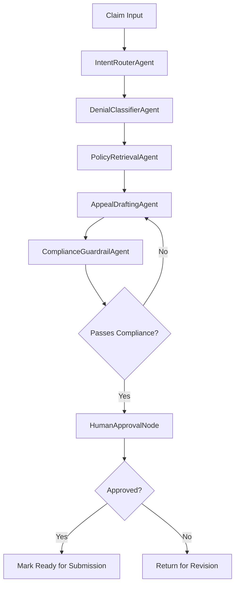

# ClaimPilot™

**Agentic AI Platform for Professional Claim Denial Intelligence & Appeal Automation**

[](LICENSE)
[](https://www.python.org/)
[](https://fastapi.tiangolo.com/)
[](https://reactjs.org/)

---

## 🎯 Overview

ClaimPilot™ is an **enterprise-grade agentic AI platform** designed to automate the analysis of professional healthcare claim denials and generate compliant appeal letters. Built with **LangChain**, **LangGraph**, and **Claude Sonnet**, it demonstrates production-quality agentic architecture with human-in-the-loop governance.

### Key Capabilities

- **Intelligent Denial Classification** - Automatically categorizes denials into Coverage, Medical Necessity, Coding, Authorization, or Other
- **RAG-Powered Policy Retrieval** - Leverages pgvector for semantic search across policy documents
- **Automated Appeal Drafting** - Generates professional, compliant appeal letters with policy references
- **Human-in-the-Loop Governance** - Requires explicit approval before any submission
- **Complete Auditability** - Every decision, retrieval, and draft is logged for compliance

---

## 🏗️ Architecture

ClaimPilot™ implements a **multi-agent orchestration** pattern using LangGraph:

### Agent Responsibilities

| Agent | Responsibility |
|-------|---------------|
| **IntentRouterAgent** | Determines workflow path based on input completeness and quality |
| **DenialClassifierAgent** | Classifies denial into predefined categories using LLM reasoning |
| **PolicyRetrievalAgent** | Performs semantic search for relevant policy excerpts (RAG) |
| **AppealDraftingAgent** | Generates formal appeal letter with citations and rationale |
| **ComplianceGuardrailAgent** | Validates draft for tone, completeness, and regulatory compliance |
| **HumanApprovalNode** | Presents draft to user for review and approval |

See [architecture.md](docs/architecture.md) for detailed system design and decision rationale.

---

## 🚀 Quick Start

### Prerequisites

- **Docker** and **Docker Compose** (v2.0+)
- **Ollama** (for local LLM - default, zero cost) - [Install Ollama](https://ollama.ai/)
- *Optional*: **Anthropic** or **OpenAI** API keys (for cloud LLM providers)
- *Optional*: **Node.js** 18+ (for local frontend development)
- *Optional*: **Python** 3.11+ (for local backend development)

### LLM Provider Options

ClaimPilot™ supports **three LLM providers** via abstraction layer:

| Provider | Model | Cost | Setup |
|----------|-------|------|-------|
| **Local (Default)** | Llama 3.1 (8B) via Ollama | $0 | `ollama pull llama3.1:8b` |
| **Anthropic** | Claude 3.5 Sonnet | ~$0.013/appeal | Add `ANTHROPIC_API_KEY` to `.env` |
| **OpenAI** | GPT-4 | ~$0.010/appeal | Add `OPENAI_API_KEY` to `.env` |

**Default**: Local Ollama (no API keys needed, data stays on-premises)

### Installation

1. **Clone the repository**
   ```bash
   git clone <repository-url>
   cd claim-denial-management
   ```

2. **Set up local LLM (Ollama)**
   ```bash
   # Install Ollama: https://ollama.ai/download
   # Pull Llama 3.1 model
   ollama pull llama3.1:8b
   
   # Start Ollama service (runs on http://localhost:11434)
   ollama serve
   ```

3. **Configure environment variables**
   ```bash
   cp .env.example .env
   # Default uses local LLM - no API keys needed!
   
   # Optional: To use cloud providers, edit .env:
   # LLM_PROVIDER=anthropic
   # ANTHROPIC_API_KEY=sk-ant-...
   ```

4. **Start all services**
   ```bash
   docker-compose up -d
   ```

5. **Load seed data**
   ```bash
   # Wait 30 seconds for database initialization
   docker-compose exec database psql -U claimpilot -d claimpilot_db -f /seed_data.sql
   ```

### Access Points

- **Frontend UI**: [http://localhost:2400](http://localhost:2400)
- **Backend API**: [http://localhost:1500](http://localhost:1500)
- **API Documentation**: [http://localhost:1500/docs](http://localhost:1500/docs)
- **PostgreSQL**: `localhost:5432` (user: `claimpilot`, db: `claimpilot_db`)

---

## 🧪 Development

### Backend (FastAPI)

```bash
cd backend
python -m venv venv
source venv/bin/activate  # On Windows: venv\Scripts\activate
pip install -r requirements.txt
uvicorn app.main:app --reload --port 1500
```

### Frontend (React + Vite)

```bash
cd frontend
npm install
npm run dev
```

### Database Migrations

```bash
# Create new migration
alembic revision --autogenerate -m "Description"

# Apply migrations
alembic upgrade head

# Rollback
alembic downgrade -1
```

---

## 📊 Data Model

### Core Entities

- **Claims** - Input claim data with denial information
- **Policies** - Policy documents with vector embeddings for RAG
- **Appeals** - Generated appeal letters and their approval status
- **AuditLogs** - Complete trace of all agent decisions and retrievals

See [database schema diagram](docs/architecture.md#database-schema) for entity relationships.

---

## 🔒 Security & Compliance

- **No Training on User Data** - All LLM interactions are zero-retention
- **Audit Trail** - Every action logged with timestamps and reasoning
- **Data Isolation** - Tenant-aware queries (ready for multi-tenant expansion)
- **Secret Management** - Environment-based configuration, no hardcoded credentials
- **Input Validation** - Pydantic schemas for all API inputs

---

## 🎭 Agent Workflow



See [architecture.md](docs/architecture.md) for detailed workflow orchestration.

---

## 🧠 LLM Provider Strategy & Abstraction

### Why Provider Abstraction?

ClaimPilot™ uses a **factory pattern** to support multiple LLM providers without changing agent code. This provides:

1. **Cost Flexibility** - Use free local models for development, cloud for production
2. **Data Privacy** - Local LLM keeps all data on-premises (no external API calls)
3. **Vendor Independence** - Switch providers via configuration, no code changes
4. **Development Velocity** - Develop offline without API key dependencies

### Architecture

```
┌────────────────────┐
│   LLMFactory       │  ← Agents request LLMs here
└─────────┬──────────┘
          │
    ┌─────┴─────┬─────────────┐
    │           │             │
┌───▼────┐ ┌───▼────┐  ┌─────▼─────┐
│ Local  │ │Anthropic│  │  OpenAI   │
│(Ollama)│ │(Claude) │  │  (GPT-4)  │
└────────┘ └─────────┘  └───────────┘
```

### Configuration

Set `LLM_PROVIDER` in `.env`:

```bash
# Local (default) - no API keys needed
LLM_PROVIDER=local
OLLAMA_MODEL=llama3.1:8b

# Cloud providers (optional)
LLM_PROVIDER=anthropic
ANTHROPIC_API_KEY=sk-ant-...

LLM_PROVIDER=openai
OPENAI_API_KEY=sk-...
```

All agents automatically use the configured provider - no code changes required.

### Trade-offs

| Provider | Quality | Cost | Privacy | Speed |
|----------|---------|------|---------|-------|
| **Local (Llama 3.1)** | Good (70% of Claude) | $0 | ✅ On-prem | Medium (CPU: 5-10s) |
| **Anthropic (Claude)** | Excellent | $0.013/appeal | ⚠️ Cloud | Fast (1-3s) |
| **OpenAI (GPT-4)** | Excellent | $0.010/appeal | ⚠️ Cloud | Fast (1-2s) |

**Recommendation**: Use **local** for prototypes/pilots, **cloud** for production quality.

See [Design Document Section 9](docs/DESIGN_DOCUMENT.md#9-llm-strategy--governance) for detailed governance strategy.

---

## 📈 Performance Considerations

- **Latency Target**: < 15 seconds for end-to-end appeal generation
- **Cost Control**: Caching of policy embeddings, prompt optimization
- **Scalability**: Stateless agents, horizontal scaling ready
- **Vector Search**: pgvector with HNSW indexing for sub-100ms retrieval

---

## 🧩 Tech Stack

| Layer | Technology |
|-------|-----------|
| **Frontend** | React 18, Vite, TailwindCSS |
| **Backend** | Python 3.11, FastAPI, Pydantic v2 |
| **AI Orchestration** | LangChain, LangGraph |
| **LLM (Default)** | Llama 3.1 8B (Ollama - Local) |
| **LLM (Optional)** | Claude 3.5 Sonnet, GPT-4 |
| **Database** | PostgreSQL 16, pgvector |
| **Containerization** | Docker, Docker Compose |

---

## 📚 Documentation

- [Architecture & Design](docs/architecture.md) - System overview, agent design, trade-offs
- [API Reference](http://localhost:1500/docs) - Interactive Swagger documentation
- [Design Document (PDF)](docs/ClaimPilot_Design_Document.pdf) - Formal design specification

---

## 🧭 Roadmap

- [ ] Multi-payer policy template library
- [ ] Batch processing for multiple claims
- [ ] ML-based denial prediction (proactive)
- [ ] Integration with EHR systems (HL7 FHIR)
- [ ] Multi-language support
- [ ] Advanced analytics dashboard

---

## 🤝 Contributing

This is a prototype demonstration project. For production deployment:

1. Implement comprehensive error handling
2. Add rate limiting and request throttling
3. Set up monitoring (Prometheus, Grafana)
4. Configure HTTPS/TLS
5. Implement proper authentication (OAuth2)

---

## 📄 License

MIT License - See [LICENSE](LICENSE) file

---

## 👥 Authors

Built as a demonstration of production-grade agentic AI architecture.

---

## 🙏 Acknowledgments

- Anthropic (Claude Sonnet)
- LangChain team
- FastAPI and Pydantic communities
