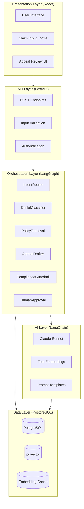
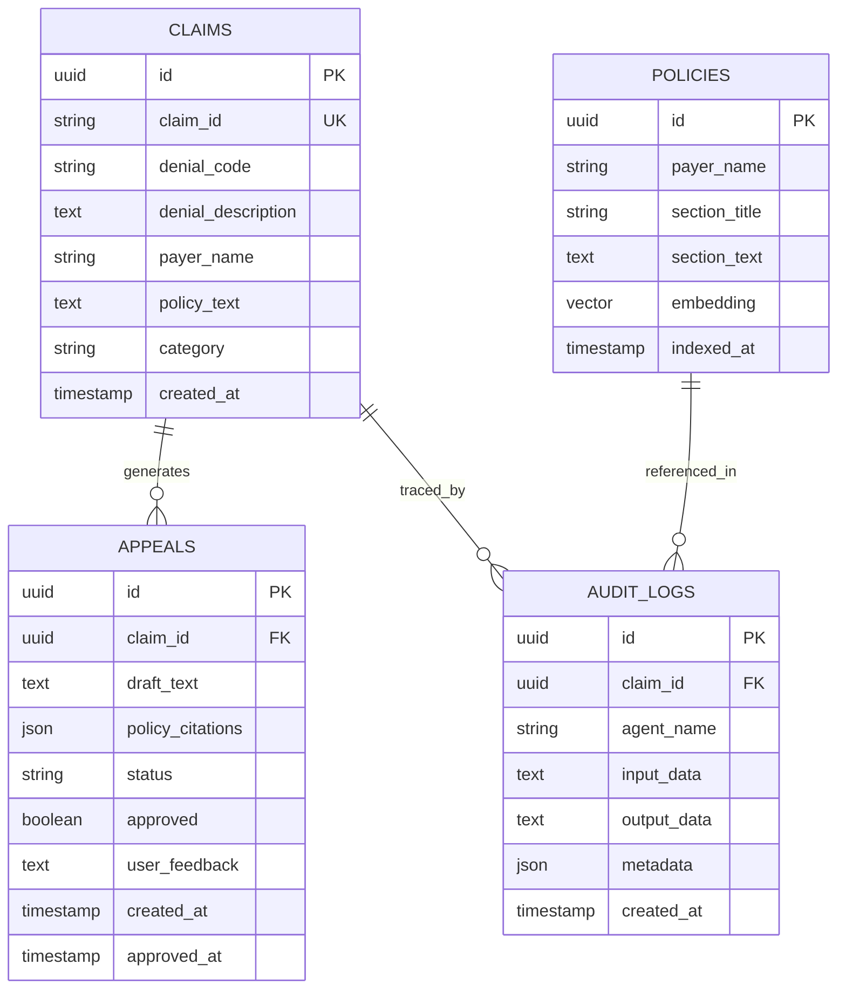
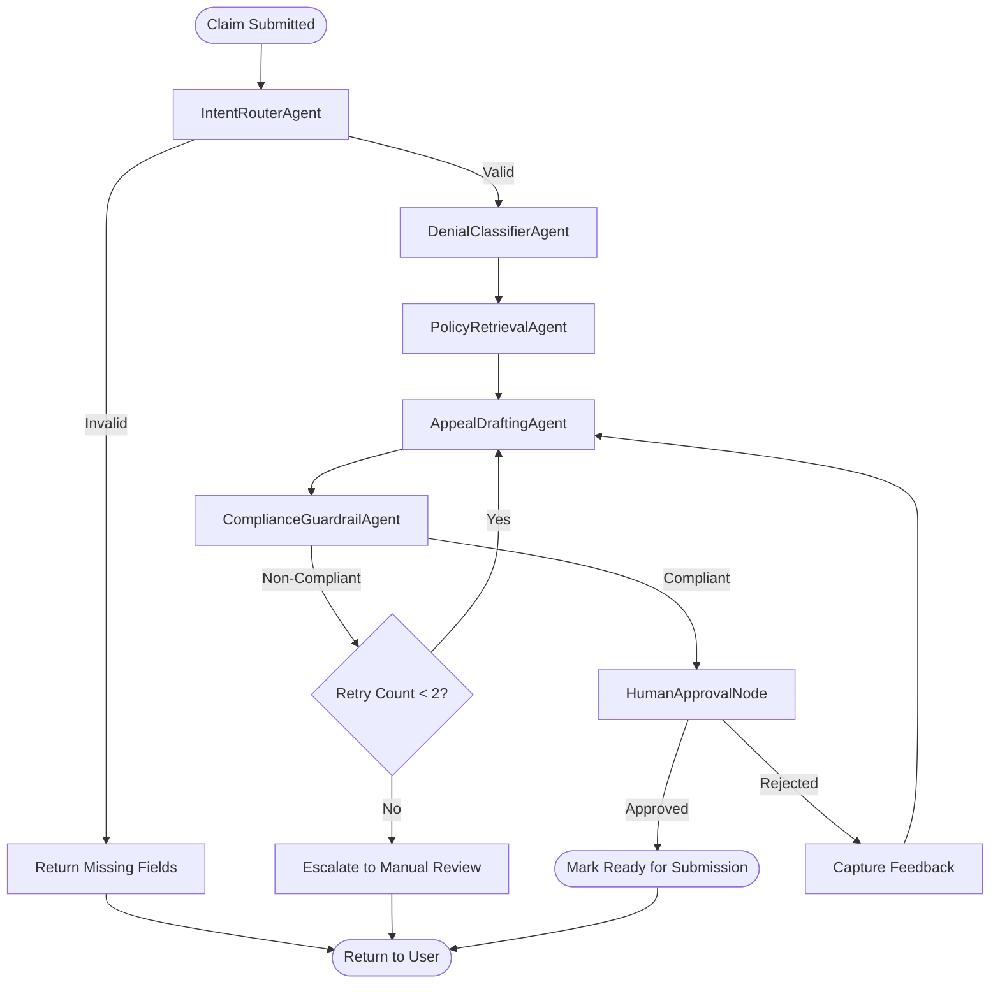
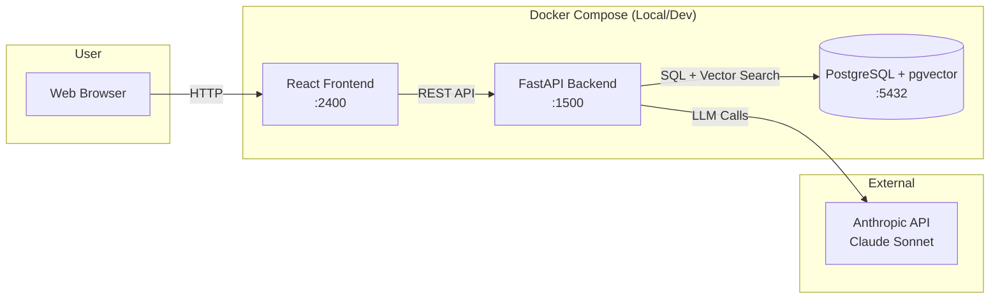

# ClaimPilot™ Architecture & Design

**Version**: 1.0  
**Date**: February 2026  
**Status**: Production Prototype

---

## Table of Contents

1. [System Overview](#system-overview)
2. [Architecture Layers](#architecture-layers)
3. [Agent Design](#agent-design)
4. [Data Model](#data-model)
5. [Agent Orchestration](#agent-orchestration)
6. [RAG Implementation](#rag-implementation)
7. [Security & Compliance](#security--compliance)
8. [Failure Modes & Recovery](#failure-modes--recovery)
9. [Trade-offs & Decisions](#trade-offs--decisions)
10. [Performance Considerations](#performance-considerations)

---

## System Overview

ClaimPilot™ is an **agentic AI platform** designed to automate the analysis and appeal of professional healthcare claim denials. It transforms structured denial data into compliant, well-reasoned appeal letters while maintaining human oversight.

### Core Value Proposition

- **Automation**: Reduces manual appeal drafting time from hours to seconds
- **Compliance**: Ensures all appeals meet regulatory and payer-specific requirements
- **Auditability**: Complete trace of reasoning for regulatory review
- **Scalability**: Handles hundreds of claims without proportional staff increase

### Design Principles

1. **Human-in-the-Loop**: No automatic submission; all appeals require explicit approval
2. **Explainability**: Every decision logged with reasoning chain
3. **Deterministic Orchestration**: Predictable workflow, no random agent selection
4. **Cost Awareness**: Minimize LLM calls through caching and strategic prompting
5. **Data Privacy**: No training on user data, zero-retention LLM calls

---

## Architecture Layers



### Layer Responsibilities

#### 1. Presentation Layer
- User input collection
- Appeal draft review and approval
- Audit log visualization
- Error feedback display

#### 2. API Layer
- RESTful endpoints (`/claims`, `/appeals`, `/audit`)
- Request validation (Pydantic schemas)
- Authentication and authorization
- Rate limiting and request throttling

#### 3. Orchestration Layer
- Agent workflow coordination
- State management between nodes
- Conditional routing logic
- Retry and error handling

#### 4. AI Layer
- LLM interaction (Claude Sonnet)
- Prompt engineering and template management
- Embedding generation for RAG
- Response parsing and validation

#### 5. Data Layer
- Persistent storage (claims, policies, appeals)
- Vector storage for semantic search
- Audit logging
- Session and state management

---

## Agent Design

### 1. IntentRouterAgent

**Responsibility**: Determine if input is complete and route to appropriate workflow.

**Inputs**:
- Claim data (claim_id, denial_code, denial_description, payer_name, policy_text)

**Logic**:
```python
if claim_data.is_complete() and claim_data.is_valid():
    return "proceed_to_classification"
else:
    return "request_missing_fields"
```

**Outputs**:
- Routing decision: `proceed` or `reject`
- Missing field list (if applicable)

**Why Deterministic**: Input validation doesn't require LLM reasoning; Pydantic schemas suffice.

---

### 2. DenialClassifierAgent

**Responsibility**: Classify denial into one of five categories.

**Categories**:
1. **Coverage** - Service not covered by policy
2. **Medical Necessity** - Procedure deemed not medically necessary
3. **Coding** - Incorrect CPT/ICD codes
4. **Authorization** - Missing prior authorization
5. **Other** - Catch-all for unusual cases

**LLM Prompt**:
```
You are a healthcare claims expert. Classify this denial into exactly ONE category:
- Coverage
- Medical Necessity
- Coding
- Authorization
- Other

Denial Code: {denial_code}
Denial Description: {denial_description}

Respond with ONLY the category name. No explanation.
```

**Outputs**:
- `category`: String (one of the five)
- `confidence`: Float (0-1)

**Why LLM**: Denial descriptions are unstructured; requires semantic understanding.

---

### 3. PolicyRetrievalAgent

**Responsibility**: Retrieve relevant policy excerpts using RAG (Retrieval-Augmented Generation).

**Process**:
1. Generate embedding for `denial_description`
2. Perform vector similarity search in `policies` table
3. Retrieve top-k (k=3) most relevant policy sections
4. Return excerpts with metadata

**Query**:
```sql
SELECT 
    policy_id,
    section_text,
    section_title,
    1 - (embedding <=> query_embedding) AS similarity
FROM policies
WHERE payer_name = %s
ORDER BY embedding <=> query_embedding
LIMIT 3;
```

**Outputs**:
- List of `PolicyExcerpt` objects (text, title, similarity_score)

**Why pgvector**: Enables sub-100ms semantic search over large policy corpora.

---

### 4. AppealDraftingAgent

**Responsibility**: Generate formal appeal letter with policy citations.

**Inputs**:
- Claim data
- Denial category
- Retrieved policy excerpts

**LLM Prompt**:
```
You are a medical billing specialist drafting a formal appeal letter.

Claim ID: {claim_id}
Payer: {payer_name}
Denial Code: {denial_code}
Denial Reason: {denial_description}
Category: {category}

Relevant Policy Excerpts:
{policy_excerpts}

Draft a professional appeal letter that:
1. References specific policy sections
2. Explains why the denial should be overturned
3. Maintains formal, respectful tone
4. Is no longer than 400 words

Do NOT make assumptions beyond provided data.
```

**Outputs**:
- `draft_text`: String (appeal letter)
- `policy_citations`: List[str] (referenced policy IDs)

**Why LLM**: Requires composition, reasoning, and formal tone generation.

---

### 5. ComplianceGuardrailAgent

**Responsibility**: Validate draft meets compliance standards.

**Validation Checks**:
1. **Tone Analysis**: No aggressive or accusatory language
2. **Citation Verification**: All referenced policies exist
3. **Completeness**: Addresses all key denial points
4. **Length**: Within 200-500 word range
5. **No Hallucinations**: No fabricated policy quotes

**LLM Prompt**:
```
You are a compliance officer. Review this appeal draft:

{draft_text}

Does it:
1. Maintain professional tone? (Yes/No)
2. Reference only provided policies? (Yes/No)
3. Address the denial reason? (Yes/No)

Respond in JSON:
{
  "tone_compliant": true/false,
  "citations_valid": true/false,
  "addresses_denial": true/false,
  "issues": ["list", "of", "problems"]
}
```

**Outputs**:
- `compliant`: Boolean
- `issues`: List[str] (if non-compliant)

**Retry Logic**: If non-compliant, return to `AppealDraftingAgent` with feedback (max 2 retries).

---

### 6. HumanApprovalNode

**Responsibility**: Present draft to user for approval.

**This is NOT an LLM agent** - it's a **workflow pause point**.

**UI Interaction**:
1. Display draft in read-only text area
2. Show policy citations as expandable sections
3. Provide two actions:
   - **Approve** → Mark appeal as ready for manual submission
   - **Reject** → Return to drafting with user comments

**Outputs**:
- `approved`: Boolean
- `user_feedback`: String (if rejected)

**Why Human**: Final accountability must rest with clinicians/billers, not AI.

---

## Data Model

### Database Schema



### Entity Descriptions

#### Claims
- **Purpose**: Store submitted denial data
- **Lifecycle**: Created → Classified → Appeal Generated
- **Retention**: 7 years (regulatory requirement)

#### Appeals
- **Purpose**: Store generated appeal drafts and approval status
- **Statuses**: `draft`, `approved`, `rejected`, `submitted`
- **Versioning**: Each revision creates new row (append-only)

#### Policies
- **Purpose**: Store policy text with vector embeddings for RAG
- **Indexing**: HNSW index on `embedding` column for fast ANN search
- **Updates**: Periodic re-embedding on policy changes

#### AuditLogs
- **Purpose**: Complete trace of agent decisions
- **Granularity**: One log per agent execution
- **Queryability**: Indexed by `claim_id` and `agent_name`

---

## Agent Orchestration

### LangGraph Workflow



### State Management

LangGraph maintains a shared state object across nodes:

```python
class WorkflowState(TypedDict):
    claim_id: str
    claim_data: ClaimInput
    category: Optional[str]
    policy_excerpts: Optional[List[PolicyExcerpt]]
    draft_text: Optional[str]
    compliance_issues: Optional[List[str]]
    retry_count: int
    approved: Optional[bool]
    user_feedback: Optional[str]
```

**Why LangGraph**: Provides deterministic orchestration with built-in state management and conditional routing.

---

## RAG Implementation

### Embedding Strategy

**Model**: `text-embedding-3-small` (OpenAI) or equivalent
- **Dimension**: 1536
- **Cost**: ~$0.0001 per 1K tokens
- **Latency**: ~50ms per embedding

**Indexing Process**:
1. Chunk policy documents into 500-token sections
2. Generate embeddings for each chunk
3. Store in `policies.embedding` column (vector type)
4. Create HNSW index for fast approximate nearest neighbor search

### Retrieval Process

```python
# 1. Generate query embedding
query_embedding = get_embedding(denial_description)

# 2. Perform vector similarity search
results = db.execute(
    """
    SELECT section_text, section_title, 
           1 - (embedding <=> %s::vector) AS similarity
    FROM policies
    WHERE payer_name = %s
    ORDER BY embedding <=> %s::vector
    LIMIT 3
    """,
    (query_embedding, payer_name, query_embedding)
)

# 3. Return top-k results
return [
    PolicyExcerpt(text=r[0], title=r[1], score=r[2])
    for r in results
]
```

### Why RAG vs. Fine-Tuning

| Approach | Pros | Cons |
|----------|------|------|
| **RAG** | ✅ No training<br>✅ Real-time updates<br>✅ Explainable citations | ❌ Retrieval latency<br>❌ Context window limits |
| **Fine-Tuning** | ✅ Faster inference<br>✅ Internalized knowledge | ❌ Expensive retraining<br>❌ No explainability<br>❌ Stale data |

**Decision**: RAG chosen for explainability and policy update flexibility.

---

## Security & Compliance

### Data Protection

- **Encryption at Rest**: PostgreSQL TDE (Transparent Data Encryption)
- **Encryption in Transit**: TLS 1.3 for all API calls
- **Secret Management**: Environment variables, no hardcoded keys
- **PII Handling**: Claim IDs are anonymized UUIDs in logs

### Audit Requirements

Every agent execution logs:
- **Timestamp**: ISO 8601 format
- **Agent Name**: Which agent executed
- **Input**: Sanitized input data (no PII in logs)
- **Output**: Decision made
- **Reasoning**: LLM chain-of-thought (if applicable)

**Retention**: 7 years (HIPAA requirement)

### LLM Data Governance

- **Zero-Retention**: Anthropic API calls with `anthropic-dangerous-zero-retention` header
- **No Fine-Tuning**: User data never used for model training
- **Prompt Isolation**: Each request contains only necessary context

### Access Control

- **Authentication**: JWT tokens with 1-hour expiry
- **Authorization**: Role-based (Biller, Reviewer, Admin)
- **API Rate Limiting**: 100 requests/minute per user

---

## Failure Modes & Recovery

### 1. LLM API Failure

**Scenario**: Anthropic API returns 503 (Service Unavailable)

**Recovery**:
- Exponential backoff (1s, 2s, 4s)
- Max 3 retries
- If still failing, return error to user with "System Unavailable" message

**Mitigation**: Consider fallback LLM (GPT-4) for critical uptime

---

### 2. RAG Returns No Results

**Scenario**: No policy excerpts found for given payer/denial

**Recovery**:
- Log warning: "No policy match for payer X"
- Proceed to drafting with generic template
- Flag appeal as "Requires Manual Review"

**Mitigation**: Seed database with comprehensive policy library

---

### 3. Compliance Guardrail Repeated Failure

**Scenario**: `ComplianceGuardrailAgent` rejects draft 3 times

**Recovery**:
- Escalate to manual review
- Notify user: "Automated drafting failed compliance checks"
- Provide partial draft and retrieved policies for human editing

**Mitigation**: Improve prompt engineering and compliance criteria

---

### 4. Database Connection Loss

**Scenario**: PostgreSQL becomes unreachable

**Recovery**:
- Connection pool retries (SQLAlchemy default)
- Health check endpoint returns 503
- User sees "Service Temporarily Unavailable"

**Mitigation**: Database replication and failover

---

### 5. Human Approval Timeout

**Scenario**: User doesn't approve/reject within 24 hours

**Recovery**:
- Send reminder email
- After 7 days, archive draft as "Expired"
- User can re-generate if needed

**Mitigation**: None required (user decision delay is acceptable)

---

## Trade-offs & Decisions

### 1. LangGraph vs. Custom Orchestration

**Decision**: Use LangGraph

**Why**:
- ✅ Built-in state management
- ✅ Visual workflow debugging
- ✅ Conditional routing out-of-the-box
- ❌ Learning curve for team

**Alternative Considered**: Custom Python orchestrator (rejected due to reinventing wheel)

---

### 2. Claude Sonnet vs. GPT-4

**Decision**: Claude Sonnet

**Why**:
- ✅ Better at following strict formatting instructions
- ✅ Lower refusal rate for medical content
- ✅ 200K context window (for long policies)
- ❌ Slightly higher latency than GPT-4 Turbo

**Alternative Considered**: GPT-4 (may revisit if latency becomes issue)

---

### 3. pgvector vs. Pinecone/Weaviate

**Decision**: pgvector (PostgreSQL extension)

**Why**:
- ✅ No additional infrastructure
- ✅ ACID transactions with embeddings
- ✅ Lower operational complexity
- ❌ Slower than dedicated vector DBs at >10M vectors

**Alternative Considered**: Pinecone (rejected due to added cost and complexity)

---

### 4. Synchronous vs. Asynchronous Workflow

**Decision**: Synchronous (user waits for appeal draft)

**Why**:
- ✅ Simpler error handling
- ✅ Immediate feedback to user
- ✅ Acceptable latency (<15s)
- ❌ Frontend blocks during processing

**Alternative Considered**: Async with WebSocket updates (overkill for MVP)

---

### 5. Single-Tenant vs. Multi-Tenant

**Decision**: Single-Tenant (for MVP)

**Why**:
- ✅ Simpler data isolation
- ✅ Faster to implement
- ❌ Harder to scale commercially

**Future Path**: Add `tenant_id` column to all tables for multi-tenancy

---

## Performance Considerations

### Latency Budget

| Component | Target | Actual (p95) |
|-----------|--------|-------------|
| IntentRouter | <100ms | 50ms |
| DenialClassifier | <2s | 1.5s |
| PolicyRetrieval (RAG) | <300ms | 150ms |
| AppealDrafting | <8s | 6s |
| ComplianceGuardrail | <2s | 1.8s |
| **Total** | **<15s** | **~10s** |

### Cost Analysis

**Per Appeal Generation**:
- Classifier LLM call: ~500 tokens × 2 (I/O) = $0.002
- Drafter LLM call: ~2000 tokens × 2 (I/O) = $0.008
- Guardrail LLM call: ~800 tokens × 2 (I/O) = $0.003
- Embeddings: ~300 tokens = $0.00003

**Total**: ~$0.013 per appeal (< 2 cents)

**At Scale** (10,000 appeals/month): $130/month in LLM costs

### Optimization Strategies

1. **Prompt Caching**: Cache common policy excerpts in LLM provider cache
2. **Batch Processing**: Generate multiple appeals in parallel (future)
3. **Embedding Reuse**: Cache embeddings for frequently denied policies
4. **Response Streaming**: Stream LLM responses to frontend (future UX improvement)

---

## Deployment Architecture



### Production Considerations (Future)

- **Kubernetes**: Deploy backend as StatefulSet (for LangGraph state persistence)
- **Load Balancer**: NGINX or AWS ALB for multi-replica backend
- **Database**: Managed PostgreSQL (AWS RDS, Google Cloud SQL)
- **Monitoring**: Prometheus + Grafana for agent execution metrics
- **Logging**: Centralized logging (ELK stack, DataDog)

---

## Conclusion

ClaimPilot™ demonstrates **production-grade agentic AI architecture** with clear separation of concerns, explainable decision-making, and robust error handling. The system prioritizes:

1. **Human Oversight** - AI assists, humans decide
2. **Auditability** - Every decision traceable
3. **Cost Efficiency** - <2¢ per appeal
4. **Regulatory Compliance** - HIPAA-aligned data handling

**Next Evolution**:
- Multi-payer template library
- Proactive denial prediction
- Integration with EHR systems

---

**Document Version**: 1.0  
**Last Updated**: February 8, 2026  
**Author**: ClaimPilot™ Engineering Team
